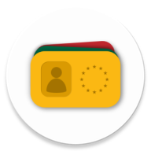

<div align="center">



# IdentID

**Your digital identity, in your pocket.**

A modern Android wallet for the European Digital Identity (EUDI) ecosystem - manage credentials, sign documents, and share identity data securely via NFC and QR.

[](LICENSE)
[](https://developer.android.com)
[](https://kotlinlang.org)
[](https://developer.android.com/jetpack/compose)

</div>

---

## Demo

https://github.com/user-attachments/assets/ident-id-demo.mp4

<video src="media/ident-id-demo.mp4" width="100%" controls></video>

---

## Features

|     | Feature                  | Description                                           |
| --- | ------------------------ | ----------------------------------------------------- |
| 🪪  | **Document Management**  | Store and browse identity documents and loyalty cards |
| ✍️  | **Document Signing**     | Digitally sign documents using RQES                   |
| 📲  | **Proximity Sharing**    | Share credentials face-to-face via QR code and BLE    |
| 📡  | **NFC Transfer**         | Tap-to-share wallet data between devices              |
| 🔐  | **Biometric & PIN Auth** | Protect access with fingerprint or device PIN         |
| 🎭  | **Pseudonyms**           | Manage pseudonymous identities for privacy            |
| 📷  | **QR Issuance**          | Add new credentials by scanning issuer QR codes       |
| 🔄  | **Device Transfer**      | Migrate your wallet to a new phone seamlessly         |

---

## Tech Stack

- **Kotlin** + **Jetpack Compose** - fully declarative UI
- **EUDI Wallet Core** - standards-compliant European Digital Identity operations
- **Room** - encrypted local credential storage
- **NFC & BLE** - proximity engagement and transfer
- **Baseline Profiles** - optimized startup performance

---

## Getting Started

### Prerequisites

- Android Studio (latest stable)
- JDK 11+
- Android SDK configured in `local.properties`

### Build & Run

```bash
# Debug build
./gradlew assembleDebug
./gradlew installDebug
```

Or open the project in Android Studio and run the `app` module on a device/emulator.

### Configuration

Copy `secrets.defaults.properties` and override with your secure values as needed.

### Generate Baseline Profile

```bash
./gradlew :app:generateBaselineProfile
```

Uses the `baselineprofile` module to capture startup and navigation journeys. The generated profile is consumed by the `release` variant.

---

## Project Structure

```
app/            Main Android application module
├── src/main    Source code & resources
├── schemas/    Room DB schema exports
baselineprofile/  Macro-benchmark profile generation
gradle/         Version catalog & wrapper
media/          App icon and demo video
```

---

## License

Licensed under the [EUPL, Version 1.2](LICENSE).

© European Commission
